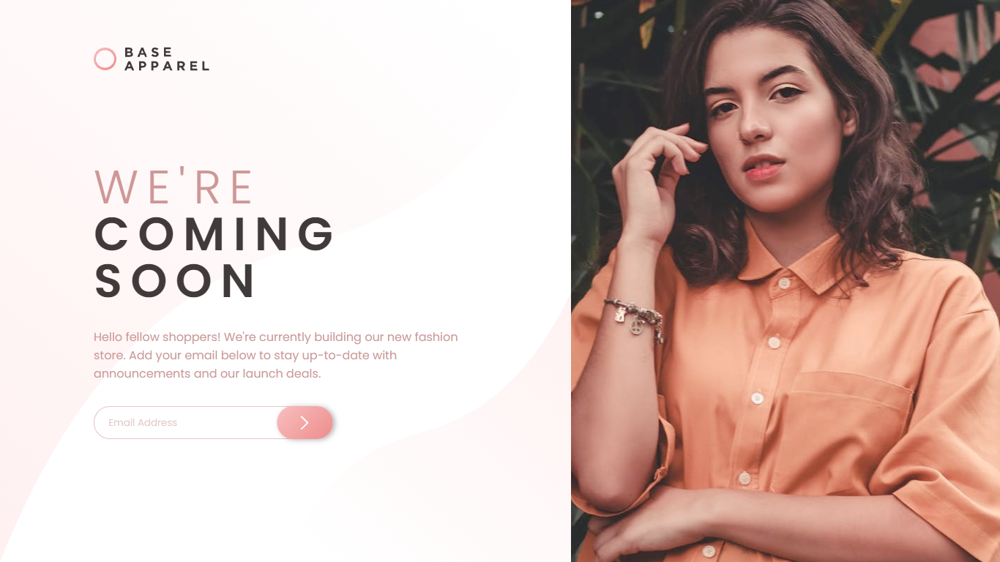

# base-apparel-coming-soon
Responsive coming soon webpage using Html, CSS &amp; JS

This is a solution to the [Base Apparel coming soon page challenge hub on Frontend Mentor](https://www.frontendmentor.io/challenges/base-apparel-coming-soon-page-5d46b47f8db8a7063f9331a0). Frontend Mentor challenges help you improve your coding skills by building realistic projects. 

## Table of contents

- [Overview](#overview)
  - [The challenge](#the-challenge)
  - [Screenshot](#screenshot)
  - [Links](#links)
- [My process](#my-process)
  - [Built with](#built-with)
  - [What I learned](#what-i-learned)
  - [Useful resources](#useful-resources)
- [Author](#author)
- [Acknowledgments](#acknowledgments)

## Overview

### The challenge

Users should be able to:

- View the optimal layout for the site depending on their device's screen size
- Receive an error message when the form is submitted if:
  - Any input field is empty
  - The email address is not formatted correctly
 
### Screenshot

### Links

- Solution URL: [Solution Site](https://www.frontendmentor.io/solutions/base-apparel-coming-soon-3kSLG9t7r)
- Live Site URL: [Live Site](https://islemmedjahdi.github.io/base-apparel-coming-soon/)

## My process

### Built with

- CSS Flexbox
- Vanilla JS

### What I learned
 
### Useful resources

- [Developer Mozzila](https://developer.mozilla.org) 
- [Elzero Web School YouTube](https://www.youtube.com/c/ElzeroInfo)

## Author

- Frontend Mentor - [@IslemMedjahdi](https://www.frontendmentor.io/profile/IslemMedjahdi)
- Twitter - [@IslemMedjahdi](https://twitter.com/IslemMedjahdi)

## Acknowledgments
